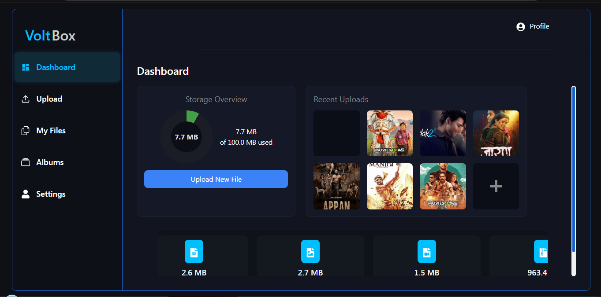
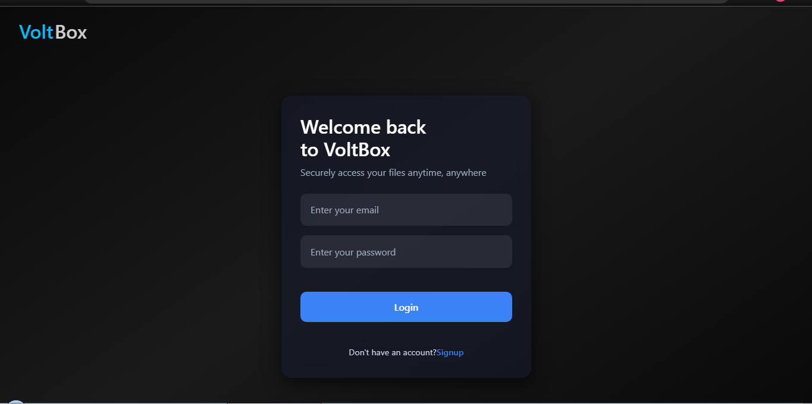
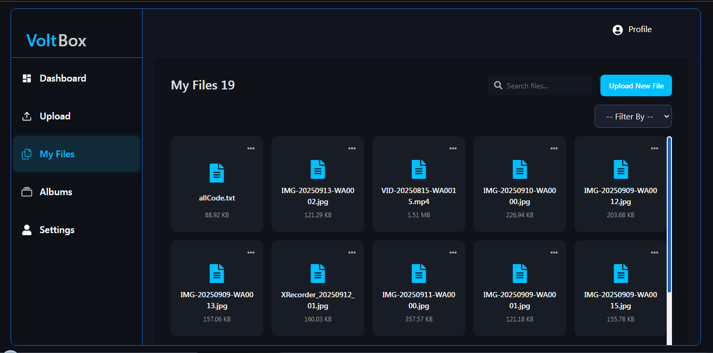
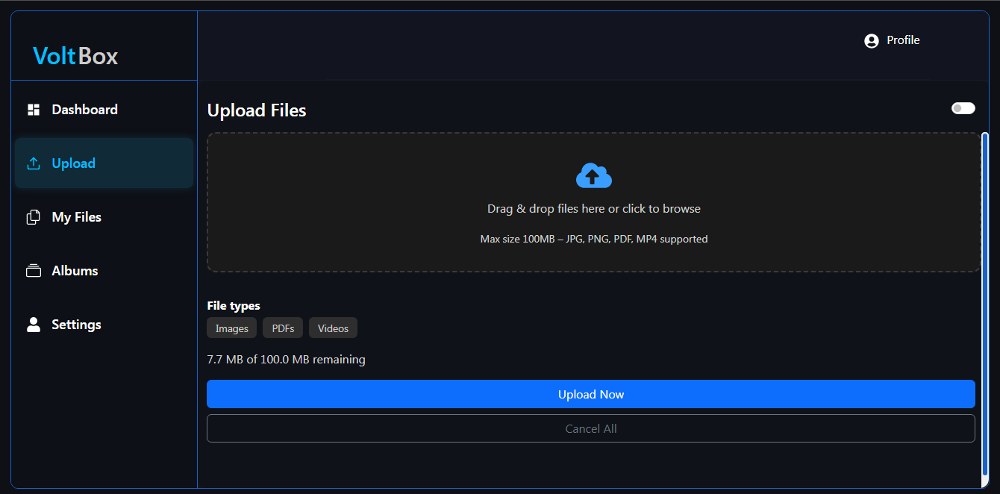

# ⚡ VoltBox Cloud Storage

Live: [https://voltbox.onrender.com](https://voltbox.onrender.com) · Repo: [https://github.com/KaranGade24/volt_box_cloud_Storage](https://github.com/KaranGade24/volt_box_cloud_Storage)

> VoltBox is a modern, full-stack cloud storage application with secure authentication, file/album management, and a responsive dashboard. Users can upload, organize, and manage files seamlessly, all in one place.

---

## 📚 Table of Contents

- [Motivation](#motivation)
- [Tech Stack](#tech-stack)
- [Features](#features)
- [Screenshots](#screenshots)
- [Project Structure](#project-structure)
- [Setup & Installation](#setup--installation)
- [Usage](#usage)

---

## 🧭 Motivation

VoltBox Cloud Storage was designed to provide a secure and organized platform for managing personal or team files online. It solves the need for easy upload, album organization, file previews, and a responsive dashboard for cloud file management — all in one full-stack web application.

---

## 🛠 Tech Stack

**Frontend**

- React (Vite)
- React Router
- Context API for state
- Modular CSS

**Backend**

- Node.js, Express
- MongoDB (Mongoose)
- Cloudinary (file/media storage) + Multer (uploads)
- JWT for authentication

---

## ✅ Features

- User signup, login, and secure JWT-based authentication
- Upload, rename, delete, and view files
- Organize files into albums and manage them easily
- Dashboard displaying storage usage, recent uploads, and file statistics
- Profile & settings management
- Responsive design for desktop and mobile
- Modern, clean UI for intuitive file management

---

## 📸 Screenshots

> Add screenshots into `/screenshots/` folder. Example:

### 🏠 Landing / Dashboard

<p align="center">  
    
</p>

### 🔐 Login Page

<p align="center">  
    
</p>

### 📂 My Files / Album View

<p align="center">  
    
</p>

### 📤 Upload / Create Album

<p align="center">  
    
</p>

---

## 🗂 Project Structure

```
volt_box_cloud_Storage/
│
├── backend/
│   ├── index.js                # Express server entry point
│   ├── package.json
│   ├── config/
│   │   └── db.js               # MongoDB connection
│   ├── controller/
│   │   ├── album.js
│   │   ├── authentication.js
│   │   ├── DashboardData.js
│   │   └── file.js
│   ├── middlewares/
│   │   ├── authentication.js
│   │   └── multer.js
│   ├── model/
│   │   ├── album.js
│   │   ├── file.js
│   │   └── user.js
│   ├── routes/
│   │   ├── album.js
│   │   ├── authentication.js
│   │   ├── DashboardData.js
│   │   └── file.js
│   └── utils/
│       ├── cloudinary.js
│       └── uploadToCloudinary.js
│
├── frontend/
│   ├── package.json
│   ├── vite.config.js
│   ├── public/
│   └── src/
│       ├── main.jsx
│       ├── App.jsx
│       ├── index.css
│       ├── assets/
│       ├── components/
│       │   ├── CreateAlbumModal.jsx
│       │   ├── FileCard.jsx
│       │   ├── DashboardTitle.jsx
│       │   └── ...other UI components
│       ├── pages/
│       │   ├── AlbumsPage.jsx
│       │   ├── AlbumPage.jsx
│       │   ├── Dashboard.jsx
│       │   ├── Login.jsx
│       │   ├── Signup.jsx
│       │   ├── MyFiles.jsx
│       │   ├── Upload.jsx
│       │   └── UserProfile.jsx
│       ├── routes/Router.jsx
│       └── store/                # Context API for albums/files
│
├── README.md
└── .env.example
```

---

## ⚡ Setup & Installation

### Prerequisites

- Node.js v16+ (v18+ recommended)
- npm or yarn
- MongoDB (Atlas or local)
- Cloudinary account (for file uploads)

### 1) Clone the repo

```bash
git clone https://github.com/KaranGade24/volt_box_cloud_Storage.git
cd volt_box_cloud_Storage
```

### 2) Backend

```bash
cd backend
cp .env.example .env
npm install
npm run dev              # default: http://localhost:5000
```

### 3) Frontend

```bash
cd ../frontend
cp .env.example .env
npm install
npm run dev              # default: http://localhost:5173
```

---

## 🔑 Environment Variables (examples)

**Backend `.env`**

```env
PORT=5000
MONGO_URI=mongodb+srv://<user>:<pass>@cluster0.mongodb.net/voltbox?retryWrites=true&w=majority
JWT_SECRET=supersecret
CLOUDINARY_CLOUD_NAME=xxx
CLOUDINARY_API_KEY=xxx
CLOUDINARY_API_SECRET=xxx
```

**Frontend `.env`**

```env
VITE_API_URL=http://localhost:5000/api
```

---

## Usage

1. Log in and upload files.
2. Organize files into albums.
3. View dashboard for storage stats, recent uploads, and file details.
4. Manage your profile and app settings.

---
